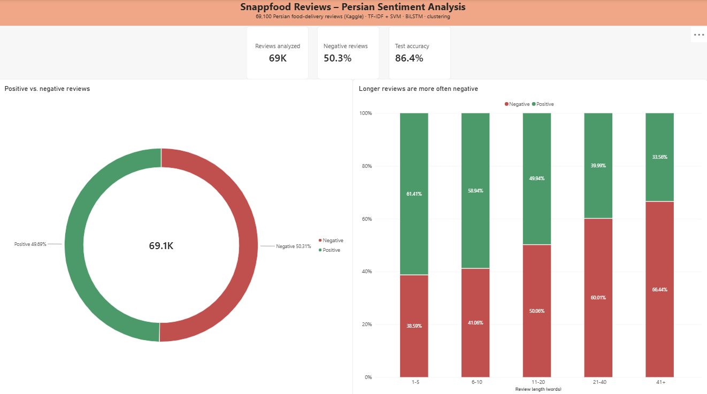
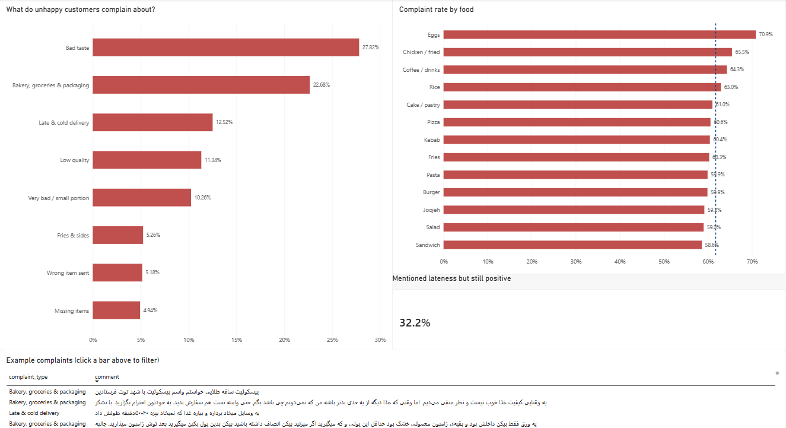
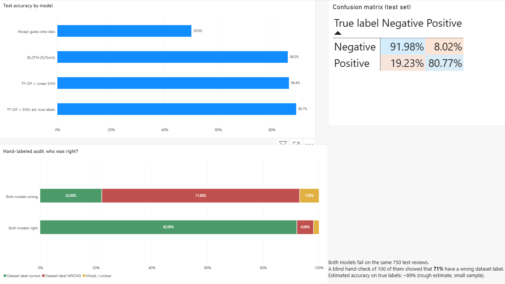

<div dir="rtl">

[English](README.md) | **فارسی**

# تحلیل احساسات و کاوش شکایت‌ها در نظرات فارسی اسنپ‌فود

یک پروژه‌ی کامل پردازش زبان طبیعی (NLP) روی **۶۹,۱۰۰ نظر فارسی** کاربران اسنپ‌فود. پروژه شامل پیش‌پردازش متن فارسی، مدل‌های کلاسیک و یادگیری عمیق برای تشخیص احساس، بررسی دستی کیفیت برچسب‌های دیتاست، خوشه‌بندی شکایت‌ها و یک داشبورد Power BI است.



## خلاصه
- یک پایپ‌لاین پردازش متن فارسی با **hazm** و یک **لیست stopword متناسب با تحلیل احساس** ساخته شد. لیست پیش‌فرض کلماتی مثل «عالی» و «نبود» را حذف می‌کرد.
- بهترین مدل: **TF-IDF (تک‌کلمه و جفت‌کلمه) + Linear SVM با دقت ۸۶٫۴٪ روی داده‌ی تست**. یک **BiLSTM** که با PyTorch از صفر آموزش دید به ۸۶٫۰٪ رسید و از آن بهتر نشد.
- یک **بررسی دستی و کور** نشان داد **۷۱٪** از خطاهای مشترک دو مدل در واقع **برچسب اشتباه دیتاست** هستند. دقت تخمینی روی برچسب‌های واقعی: **حدود ۸۹٪**.
- **خوشه‌بندی KMeans** روی ۳۴,۵۰۶ نظر منفی نشان داد حدود **نیمی از شکایت‌ها درباره‌ی خود غذاست** و حدود **یک‌چهارم درباره‌ی ارسال و درستی سفارش**.

## نتایج
داده‌ی تست: ۶,۹۱۰ نظر. فقط یک بار و در انتهای کار استفاده شد و هیچ تنظیمی روی آن انجام نشد.

| مدل | Accuracy | Macro F1 |
|---|---|---|
| حدس ثابت (همیشه یک کلاس) | ۰٫۵۰۰ | - |
| BiLSTM (PyTorch، آموزش از صفر) | ۰٫۸۶۰ | ۰٫۸۵۹ |
| **TF-IDF (تک‌کلمه + جفت‌کلمه) + Linear SVM** | **۰٫۸۶۴** | **۰٫۸۶۴** |
| TF-IDF + SVM، تخمین روی برچسب‌های واقعی | حدود ۰٫۸۹ | - |

بهترین مدل **۹۲٪** نظرهای منفی را درست تشخیص می‌دهد، ولی **۱۹٪** نظرهای مثبت را منفی می‌بیند. دلیلش این است که خیلی از نظرهای مثبت یک شکایت کوچک هم دارند.

## یافته‌های کلیدی

### پردازش متن
- **تله‌ی stopwordها.** لیست stopword پیش‌فرض hazm برای متن‌های خبری ساخته شده و کلمات احساسی مثل «عالی»، «خوب»، «نبود» و «متاسفانه» را هم دارد. برای همین یک لیست نگه‌داری با ۴۷ کلمه ساخته شد: کلمات منفی‌ساز، تضاد، شدت و ارزیابی.
- **تکراری‌های پنهان.** در داده‌ی خام هیچ نظر تکراری‌ای نبود، ولی بعد از نرمال‌سازی ۷۴۹ تکراری پیدا شد. حذف آن‌ها جلوی نشت داده (Data Leakage) بین train و test را گرفت و تعداد نظرها از ۷۰,۰۰۰ به ۶۹,۱۰۰ رسید.

### مدل‌ها
- **منفی‌سازها با جفت‌کلمه‌ها یاد گرفته شدند.** وزن «بد» در مدل ۶٫۴- است، ولی وزن «بد نبود» **۷٫۴+** است. استفاده از جفت‌کلمه (bigram) همه‌ی مدل‌ها را بهتر کرد، تا ۱٫۶ امتیاز F1.
- **Regularization مهم است.** با regularization ضعیف، F1 روی train به ۰٫۹۹ می‌رسد ولی روی validation به ۰٫۸۴ می‌افتد، یعنی Overfitting. نتیجه‌ی Cross-Validation پنج‌تایی ۰٫۸۶۰ ± ۰٫۰۰۲ است.
- **ترتیب کلمات اینجا کمکی نکرد.** BiLSTM در کل کمی ضعیف‌تر بود و روی نظرهای «هم تعریف، هم شکایت» که «ولی» دارند هم بدتر عمل کرد (۷۸٫۶٪ در برابر ۸۰٫۵٪). دلیلش این است که نظرها کوتاه‌اند (میانه‌ی ۱۳ کلمه) و LSTM بردار کلمات را فقط از ۵۵ هزار نظر یاد می‌گیرد.
- **دو مدل روی نظرهای یکسانی اشتباه می‌کنند.** ۷۵۰ نظر تست را هر دو مدل اشتباه تشخیص دادند، یعنی ۷۷ تا ۸۰ درصد خطاهای هر مدل. این نشان می‌دهد مشکل بیشتر از داده است تا از مدل.

### کیفیت برچسب‌ها
۱۵۰ نظر تست **بدون دیدن برچسب دیتاست** دستی برچسب‌گذاری شد: ۱۰۰ نظری که هر دو مدل اشتباه گفته بودند و ۵۰ نظری که هر دو درست گفته بودند، به‌صورت درهم.

| گروه | برچسب دیتاست درست | برچسب دیتاست اشتباه | دوپهلو |
|---|---|---|---|
| هر دو مدل اشتباه (۱۰۰ نظر) | ۲۲٪ | **۷۱٪** | ۷٪ |
| هر دو مدل درست (۵۰ نظر) | ۹۲٪ | ۶٪ | ۲٪ |

- نمونه‌ی برچسب اشتباه: «سیب‌زمینی‌ها غرق در روغن، مونده و سیاه بودن» در دیتاست **مثبت** برچسب خورده است.
- **حداقل حدود ۷٪ برچسب‌های داده‌ی تست اشتباه‌اند.** این عدد با پایین‌ترین حد بازه‌ی اطمینان ۹۵٪ (حدود ۶۱٪) و فقط روی ۷۵۰ خطای مشترک حساب شده است.
- **دقت واقعی حدود ۸۹٪ تخمین زده می‌شود.** این یک تخمین تقریبی است، چون به نرخ برچسب اشتباه بین پیش‌بینی‌های درست هم بستگی دارد که فقط روی ۵۰ نظر اندازه‌گیری شد.
- **یکی از خطاهای واقعی مدل‌ها طعنه است.** مثلاً «رکورد تاخیرو با ۱۶۰ دقیقه تاخیر زدید، خسته نباشید خدا قوت» منفی است، ولی پر از کلمات مؤدبانه و مثبت است.

### مشتری‌ها از چه چیزی شکایت دارند؟
| نوع شکایت | سهم از نظرهای منفی |
|---|---|
| طعم بد (Bad taste) | ۲۷٫۸٪ |
| قنادی، سوپرمارکت و بسته‌بندی (Bakery, groceries & packaging) | ۲۲٫۷٪ |
| دیر و سرد رسیدن (Late & cold delivery) | ۱۲٫۵٪ |
| کیفیت پایین (Low quality) | ۱۱٫۳٪ |
| خیلی بد یا حجم کم (Very bad / small portion) | ۱۰٫۳٪ |
| سیب‌زمینی و مخلفات (Fries & sides) | ۵٫۳٪ |
| ارسال آیتم اشتباه (Wrong item sent) | ۵٫۲٪ |
| آیتم جامانده (Missing items) | ۴٫۹٪ |

- **حدود ۴۹٪ شکایت‌ها درباره‌ی کیفیت غذا و حدود ۲۳٪ درباره‌ی ارسال و درستی سفارش است.** دیر و سرد رسیدن، آیتم اشتباه و آیتم جامانده بخشی است که خود پلتفرم مستقیماً می‌تواند بهترش کند.
- **نظرهای طولانی‌تر منفی‌ترند.** ۳۹٪ نظرهای ۱ تا ۵ کلمه‌ای منفی‌اند، ولی این عدد برای نظرهای بیشتر از ۴۰ کلمه به ۶۶٪ می‌رسد.
- **دیر رسیدن اغلب بخشیده می‌شود، سرد رسیدن نه.** ۴۲٪ نظرهایی که کلمه‌ی «دیر» دارند باز هم مثبت‌اند، معمولاً با لحن نرم مثل «کمی دیر رسید». اگر «تاخیر» را هم حساب کنیم، این عدد ۳۲٪ است. در نظرهای منفی، دیر رسیدن معمولاً همراه با سرد شدن غذا می‌آید.
- **پیتزا بدتر نیست، فقط بیشتر سفارش داده می‌شود.** نرخ شکایت همه‌ی غذاها از میانگین کل (۵۰٪) بیشتر است، چون مشتری ناراضی اسم غذا را می‌آورد ولی مشتری راضی کوتاه می‌نویسد. پیتزا (۶۰٫۶٪) وسط جدول است. تخم‌مرغ (۷۰٫۹٪، بیشتر به‌خاطر شکستگی) و مرغ (۶۵٫۵٪) بالاترین نرخ را دارند.
- **تشخیص داده‌ی پرت (Outlier Detection)** نظرهای انگلیسی (حدود ۰٫۵٪) را پیدا کرد و یک مشکل تکرارشونده را نشان داد که در خوشه‌های بزرگ گم شده بود: **ارسال نشدن قاشق و چنگال**.

## داشبورد
داشبورد در Power BI و با فایل‌های CSV ساخته‌شده در نوت‌بوک ۰۶ طراحی شده است. با کلیک روی هر نوع شکایت، جدول نمونه‌نظرها فیلتر می‌شود.

| شکایت‌ها | مدل و کیفیت داده |
|---|---|
|  |  |

## نوت‌بوک‌ها
| # | نوت‌بوک | کاری که انجام می‌دهد | اجرا |
|---|---|---|---|
| ۰۱ | `01_eda.ipynb` | حجم داده، تعادل برچسب‌ها، طول نظرها، کلمات پرتکرار | [](https://colab.research.google.com/github/alirezakiann/snappfood-sentiment/blob/main/notebooks/01_eda.ipynb) |
| ۰۲ | `02_preprocessing.ipynb` | نرمال‌سازی، stopwordهای سفارشی، حذف تکراری‌ها، تقسیم train/val/test | [](https://colab.research.google.com/github/alirezakiann/snappfood-sentiment/blob/main/notebooks/02_preprocessing.ipynb) |
| ۰۳ | `03_baseline_models.ipynb` | مقایسه‌ی ۳ نوع ویژگی TF-IDF و ۳ مدل، تنظیم regularization، اعتبارسنجی متقابل، وزن کلمات | [](https://colab.research.google.com/github/alirezakiann/snappfood-sentiment/blob/main/notebooks/03_baseline_models.ipynb) |
| ۰۴ | `04_lstm.ipynb` | BiLSTM با PyTorch، توقف زودهنگام (Early Stopping)، مقایسه بر اساس نوع نظر | [](https://colab.research.google.com/github/alirezakiann/snappfood-sentiment/blob/main/notebooks/04_lstm.ipynb) |
| ۰۵ | `05_error_analysis.ipynb` | بررسی دستی برچسب‌ها، خوشه‌بندی شکایت‌ها (TF-IDF + SVD + KMeans)، تشخیص داده‌ی پرت | [](https://colab.research.google.com/github/alirezakiann/snappfood-sentiment/blob/main/notebooks/05_error_analysis.ipynb) |
| ۰۶ | `06_dashboard_data.ipynb` | آماده‌سازی فایل‌های CSV برای داشبورد Power BI | [](https://colab.research.google.com/github/alirezakiann/snappfood-sentiment/blob/main/notebooks/06_dashboard_data.ipynb) |

## ساختار ریپازیتوری

</div>

```
snappfood-sentiment/
├── notebooks/        # 01-06, run in order
├── dashboard/        # Power BI file and screenshots
├── requirements.txt
├── README.md         # English
└── README_fa.md      # فارسی
```

<div dir="rtl">

## محدودیت‌ها
- برچسب‌ها احتمالاً از روی امتیاز ستاره‌ای ساخته شده‌اند و بخشی از آن‌ها اشتباه است (بخش کیفیت برچسب‌ها را ببینید). تخمین دقت واقعی بر اساس یک نمونه‌ی کوچک دستی است.
- دیتاست به‌صورت مصنوعی متعادل شده (دقیقاً ۵۰/۵۰)، در حالی که در دنیای واقعی احتمالاً نظرهای مثبت بیشترند.
- دسته‌بندی غذاها با کلمات کلیدی انجام شده و ممکن است املاهای متفاوت را از دست بدهد.
- BiLSTM با تنظیمات پیش‌فرض و فقط یک بار اجرا شد، در حالی که مدل پایه با دقت بیشتری تنظیم شده بود.
- خوشه‌ها به‌صورت خودکار پیدا شده‌اند و یکی از خوشه‌های بزرگ («طعم بد») هنوز چند زیرموضوع را با هم دارد.

## ابزارها
Python · pandas · scikit-learn · PyTorch · hazm · matplotlib / seaborn · Google Colab · Power BI

## نحوه‌ی اجرا
۱. دیتاست [Snappfood - Persian Sentiment Analysis](https://www.kaggle.com/datasets/soheiltehranipour/snappfood-persian-sentiment-analysis) را از Kaggle دانلود کنید (مجوز CC0). داده در این ریپازیتوری ذخیره نشده است.

۲. فایل `Snappfood - Sentiment Analysis.csv` را در گوگل درایو، مسیر `MyDrive/snappfood-sentiment/` قرار دهید.

۳. نوت‌بوک‌ها را به ترتیب و با دکمه‌های Colab بالا باز کنید و همه‌ی سلول‌ها را اجرا کنید. نوت‌بوک ۰۴ به GPU نیاز دارد (Runtime ← Change runtime type ← T4 GPU).

۴. برای داشبورد، پوشه‌ی `powerbi` ساخته‌شده توسط نوت‌بوک ۰۶ را دانلود کنید و فایل `dashboard/snappfood_dashboard.pbix` را در Power BI Desktop باز کنید.

</div>
